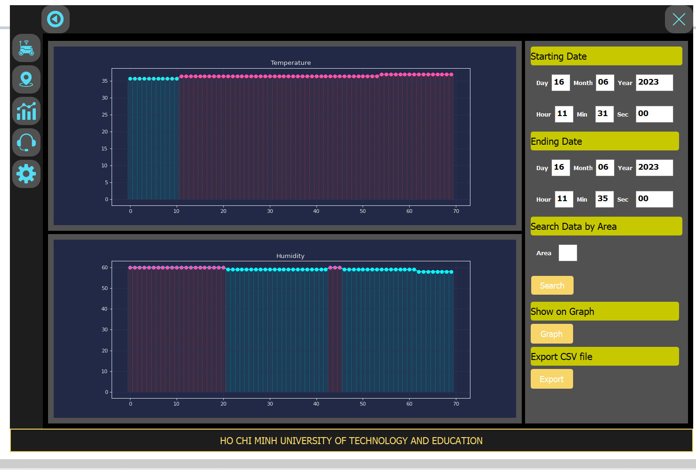

# GPS-GUILDED ENVIRONMENT MONITORING ROBOT

### 1. SYSTEM REQUIREMENT
1. **Firstly**, the system can measure environmental parameters such as temperature
and humidity, and also GPS coordinates of the vehicle. <br />
2. **Secondly**, the information transformation of the system is conducted using Wi-Fi
network protocol. Real-time database on Firebase is used to perform the
communication between the AGV system and the application. <br />
3. **Finally**, an application running on Window desktops offers a display of monitoring information including temperature, humidity, heading direction of the AGV system functionalities such as logging path by GPS coordinates, searching
for specific recorded data by date, controlling the robot. <br />

### 2. BLOCK DIAGRAM
  <br />
**Central processing block**: the central processing block of this whole system is an
esp32 microcontroller, which has the function of processing and calculating the data
collected from the sensor from the input block, thereby outputting the output. decide to control the output block, and also connect to Firebase over wifi protocol. <br />
**Output block**: output block is DC motor control components, L298N module <br />
**Input block**: includes sensor devices such as Hmc5883l (digital compass sensor),
DH11 (temperature and humidity sensor), HC-SR04 (distance sensor), Gps module
and Wi-Fi module. <br />
**Power supply block**: because the robot system needs a stable source, the
microcontroller and peripherals will be powered by exactly 5V through a voltage
regulator circuit Lm2596 with 5V and 3A output. As for the power supply for the dc
motor and driver, it will be supplied directly with the 18650 lipo battery. <br />

### 3. FIREBASE DATABASE DESIGN
The structure of the data storing on firebase are constructed similar to a structure of a Json file.
```json
{
"CAR": {
    "ENABLE": "ON",
    "Latitude": "10.916573677698755",
    "Longitude": "106.85852050781251"
},
"ESP32": {
    "Humid": 59,
    "Temp": 23
},
"GPS": {
    "Heading": 30,
    "Latitude": 10.8691957135977,
    "Longitude": 106.8896348887178
},
"STATUS": "MOVING"
}
```
### 4. USER APPLICATION INTERFACE
The system shows information such as temperature and humidity, heading angle, GPS coordinates, GPS map, also illustrate statistically data from database. <br />
 <br />
|  |  |
| :-------------: | :-------------: |
|  |  |
|  |  |

The figure shows the interactive features of the application such as button, checkboxes line edit. There are 5 page, each page will have different tasks and features. <br />
 
